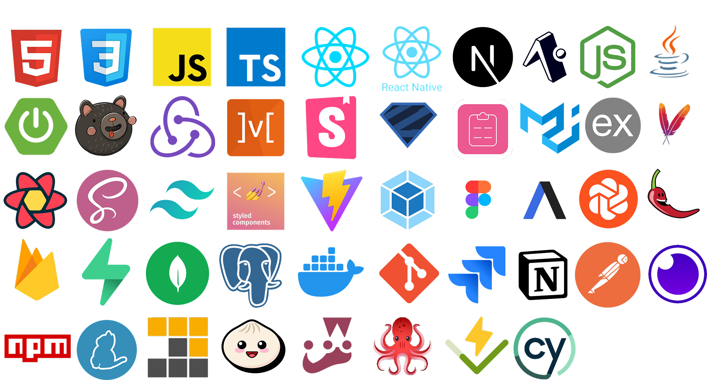

# Hi, I'm Night0wIX

I'm a passionate Web & Mobile Developer with 2 years of experience in building products using modern JavaScript technologies.

💡 I specialize in **Frontend**, also working with **Backend**, some **UI/UX design**, and basic **QA**. Currently, I'm working as a **React Native developer**, building production-ready mobile apps.

---

## 🧠 About Me

- 🔭 Currently working on cross-platform mobile apps & side tools/plugins
- 🌱 Exploring full-stack technologies and software architecture
- 🛠 Tech-savvy and detail-oriented, always open to new challenges
- 💬 I enjoy learning, mentoring, and improving codebases

---

## 🧰 Tech Stack

  

---

## 📦 Projects & Experiments

- 🧩 [plugin-smart-image](https://github.com/Night0wIX/plugin-smart-image) — plugin to optimize and import responsive images.

_(More coming soon...)_

---

## 📬 Let's Connect

- 🐙 [GitHub](https://github.com/Night0wIX)  
